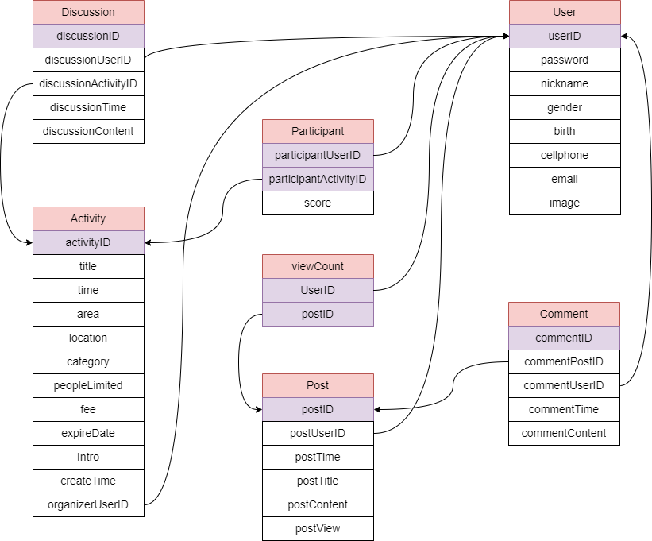

# Group_System
This is a platform for organizing group activities and events, including dining, drinking, and leisure activities, where users can create, join, and communicate with groups of like-minded individuals.
### built with
* Flask
* SQLite

# Getting Started

### Flask
```
pip install Flask
```
### database
```
funCrew_db.db
```
### start
```
python app.py
```
# 主要功能
- 會員可以註冊、登入帳號，並修改自己的會員資料
- 會員可以舉辦活動、互相在活動底下討論活動內容
- 活動人數尚未額滿時，用戶可以自行參加想要的活動
- 當參加的活動舉辦完後，可以進行評分
- 用戶也可在貼文區發文，並在文章下面留言，互相交流

# ER-model


# Relational Schema


# Files
### 與活動相關的動作
crudActivity.py
### 與貼文相關的動作
crudPost.py
### 與使用者相關的動作
crudUser.py
### pages
* /activities
* /activity_detail
* /create_post
* /delete_comment
* /delete_post
* /home
* /hostActivity
* /Info
* /login
* /my_comments
* /personalActivity
* /personalInfo
* /post_detail
* /posts
* /register
* /registration_success
* /signUpSuccess
* /update_comment
* /update_discussion
* /update_personalInfo
* /update_post


# Contributors
|  系級  |  組員  |    學號    |
|-------|--------|------------|
| 資碩一 | 鄞雋衡 | 111753135  |
| 資碩一 | 林侑萱 | 111753121  |
| 資碩一 | 思沛淇 | 111753214  |
| 資碩二 | 陳  輝 | 111753228  |
| 會計四 | 杜淑萍 | 108303067  |
| 企管四 | 劉子御 | 107202009  |

